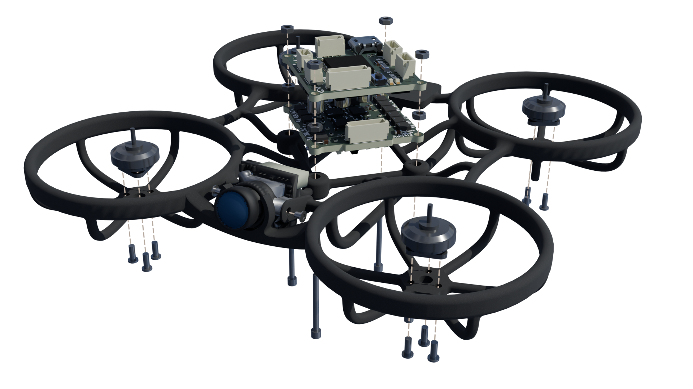
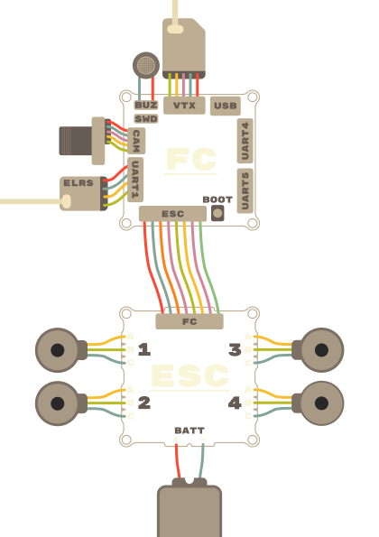
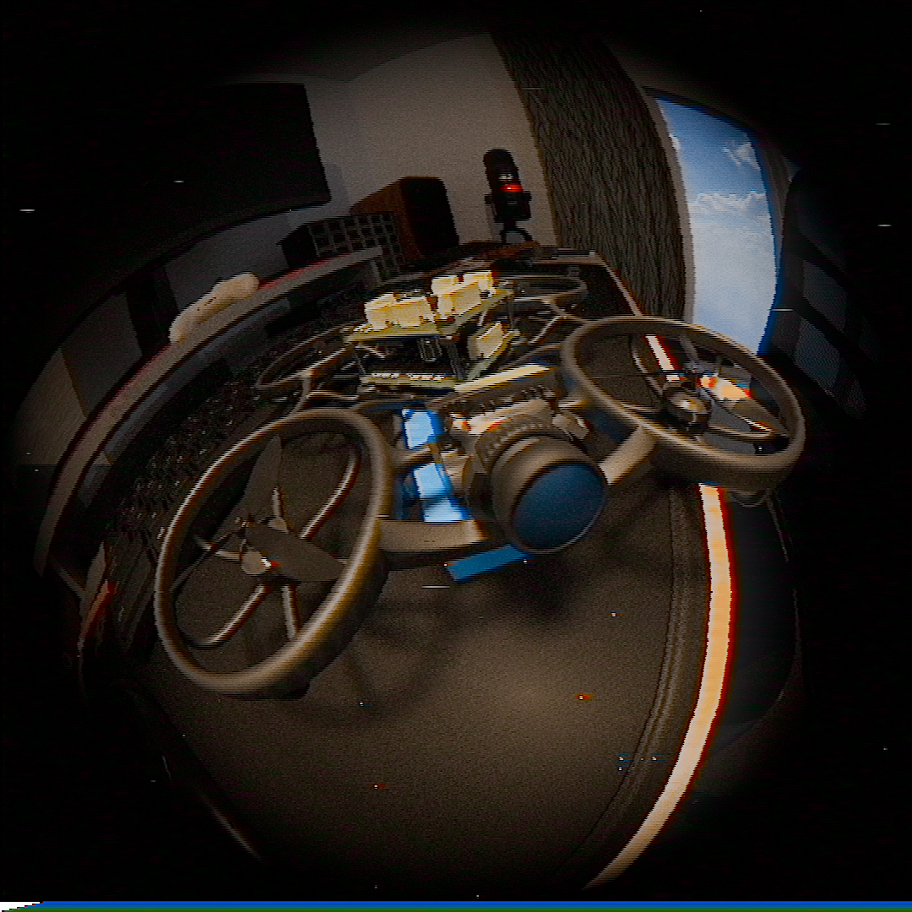
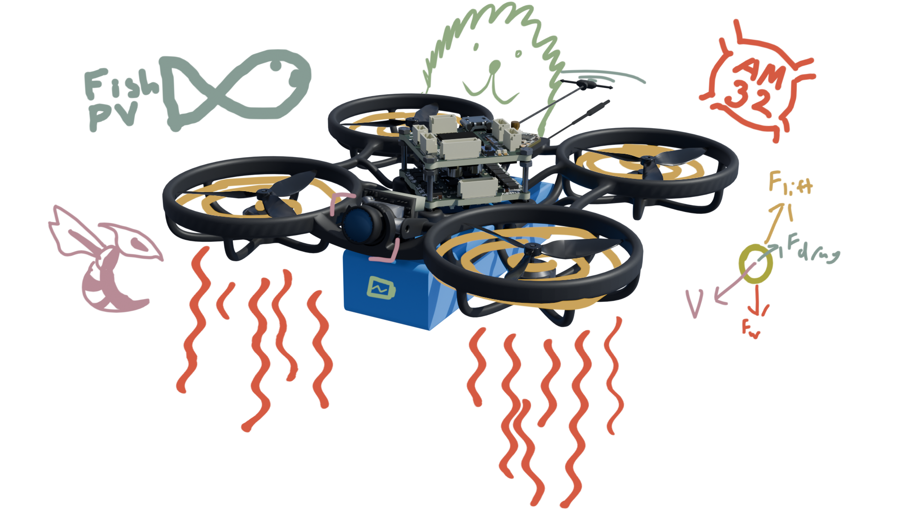
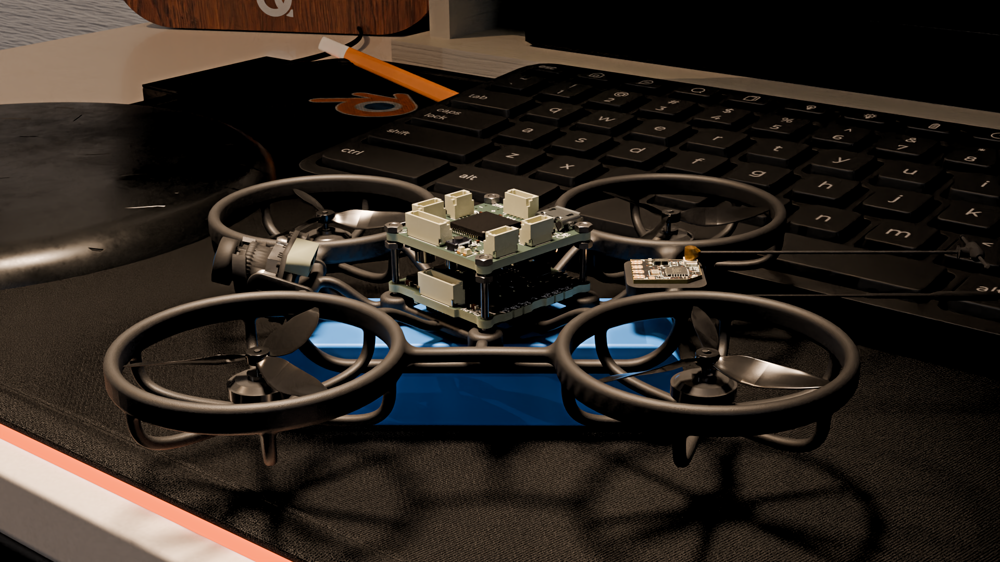
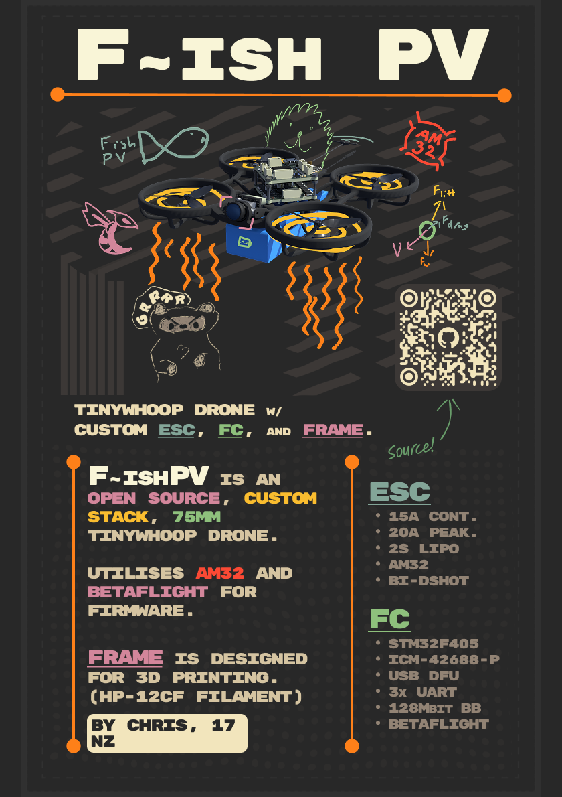

# F~ishPV

_Tinywhoop drone with custom ESC, FC, and frame._

## What?

F\~ishPV is a open source, custom stack, 75mm tinywhoop drone design.
It utilises AM32 for the ESC firmware and Betaflight for the flight controller. 

Custom components include a from-scratch frame, designed for 3d printing (in HP-12-CF filament), a fully custom 15A ESC, and a custom FC. 

**The ESC:**
- 15A Continuous
- 20A Peak for 5s (unverified :O)
- 2S Battery (only)
- AM32 Firmware
- DSHOT Communication + Voltage telemetry
- Current Sense
  
**The FC:**
- STM32F405
- OSD: MAX7456
- IMU: ICM-42688-P
- 128Mbit blackbox
- USB DFU
- 2S Battery (only)
- BEC: 5V/0.5A Max
- Mounting: 25.5x25.5
- Dimensions: 28.3x28.3x10
- UART: 1, 4, 5
- Buzzer!

## Why?

To be honest a lot of this project was just for my own learning, but I also wanted to make a drone that could be generally cheaper than buying prebuilt components. I've somewhat achieved this, with a net cost of ~$300 USD, but obviously this cost is higher due to lack of bulk pricing. Unfortunately, some parts I wanted to design from scratch proved to be infeasible within the scope of this project (namely vtx and vrx) so that has driven the total cost up slightly.

Aside from that, drones are cool, and tinywhoops especially so. The main benefit in my opinion is the crashability. The size makes it much more feasible to use alternative manufacturing options. As I mentioned earlier, I designed this with HP-12-CF filament in mind, but HP-12 MJF Nylon is also a very feasible option that could potentially be quite durable (I have simulated both, but it is worth noting that the CF simulations will not be entirely accurate due to the weakness along layer lines not being modelled).

## How to use?

The drone assembly should be reasonably straightforward, I have provided a wonderful exploded diagram that should help significantly:

Feel free to assemble it how you see fit, I'll likely change some things in the future but I'd like to try this configuration for now.

For wiring, theres this handy diagram. A lot of it just uses jst-sh connectors (as conformant to the [Betaflight Connector Standard](https://betaflight.com/docs/development/manufacturer/connector-standard)).

The ELRS receiver and vtx module can be attached however you see fit. I have included a mounting plate, and myself intend to use hot glue but velcro, etc. are also options.

Aside from the physical assembly, the FC and ESC must be flashed as outlined below or in the respective folders in **firmware/**. As I didn't want to do a bunch of pull requests for a likely one off design, I have provided compiled versions of the firmware. If you want to compile yourself, check out my forks of [Betaflight](https://github.com/cookiemonsternz/betaflight) and [AM32](https://github.com/cookiemonsternz/AM32). AM32 was built using github actions, and Betaflight was built locally using WSL as outlined in [the documentation](https://betaflight.com/docs/development#development).

### ESC Firmware

The esc runs on AM32, an open source ESC firmware which manages motor control, communication via dshot, and telemetry.

#### Bootloader

First of all, we need to install the bootloader onto each of the chips. For each chip, connect via the exposed swd/io interface, as outlined in the following table, and flash the bootloader hex file from **firmware/esc/bootloader/**

| MCU | SWDIO | SWDCLK |
|-----|-------|--------|
| 1   | TP1   | TP2    |
| 2   | TP3   | TP4    |
| 3   | TP6   | TP5    |
| 4   | TP8   | TP7    |

#### Firmware

Next connect the flight controller (which should be flashed before this step),
visit [am32 configurator](https://am32.ca/) and upload the firmware from **firmware/esc/**

---

### FC Firmware

Installation follows the same procedure as pretty much any flight controller.
Visit [Betaflight Configurator](https://app.betaflight.com/) and select firmware flasher. 

At the bottom of the screen, press load local:

Upload the hex file and then hit flash!

That's it, should be all configured (maybe) but I'd reccomend going through and doing the regular adjustments and calibration.

## Renders

## Zine Page

## Simulations

I ran a handful of simulations in FreeCAD, and these are just a small sample of the results I got. 

First up, a collision where the battery is impacted. Think the drone just dropping onto the ground. This is for a collision at approximately 50km/h assuming a collision time of 25ms and a net mass of around 250g (so probably a bit extreme), to be specific, I modelled a force of 150N.

As you can see, there is even deflection across all four mounting posts for the FC/ESC stack, which will result in minimal tensile strain on the PCBs (which is the typical cause of damage).

Another type of collision I modelled is just a collision directly to the prop guards. Again, a 150N force which would be ~50km/h as mentioned above.

There is a lot of displacement on the prop guard but it is effectively dissipated and won't have much impact on the electronics, which is the main thing to be worried about. 
For this specific impact, I would be reasonably worried about damage to the frame, but for most crashes (which are probably not at 50km/h) it should be perfectly fine.

Many more simulations at different loads and also modelling the HP-12 MJF material can be found [here](https://github.com/cookiemonsternz/drone/blob/main/journals/journal-14-05-2026.md).

## BOM

| Desc                               | Value              | Package        | Link                                                                                        | Num | Needed | MOQ | MOQ Price | Net Price | Running Total |
|------------------------------------|--------------------|----------------|---------------------------------------------------------------------------------------------|-----|--------|-----|-----------|-----------|---------------|
| **Capacitors**                         |                    |                |                                                                                             |     |        |     |           |           |               |
| 10nF Ceramic Cap, 0402             | 10nF               | 0402           | https://www.lcsc.com/product-detail/C15195.html                                             | 1   | 1      | 100 | $0.16     | $0.16     | $0.16         |
| 22nF Ceramic Cap, 0402             | 22nF               | 0402           | https://www.lcsc.com/product-detail/C1532.html                                              | 2   | 2      | 100 | $0.21     | $0.21     | $0.37         |
| 100nF Ceramic Cap, 0402            | 100nF              | 0402           | https://www.lcsc.com/product-detail/C1525.html                                              | 44  | 44     | 100 | $0.15     | $0.15     | $0.52         |
| 1uF Ceramic Cap, 0402              | 1uF                | 0402           | https://www.lcsc.com/product-detail/C52923.html                                             | 4   | 4      | 100 | $0.4      | $0.40     | $0.92         |
| 2.2uF Ceramic Cap, 0402            | 2.2uF              | 0402           | https://www.lcsc.com/product-detail/C12530.html                                             | 3   | 3      | 100 | $0.32     | $0.32     | $1.24         |
| 4.7uF Capacitors, 0603             | 4.7uF              | 0603           | https://www.lcsc.com/product-detail/C19666.html                                             | 4   | 4      | 10  | $0.11     | $0.11     | $1.35         |
| 22uF Capacitors, 0603              | 22uF               | 0603           | https://www.lcsc.com/product-detail/C86295.html                                             | 4   | 4      | 10  | $0.16     | $0.16     | $1.51         |
| 22uF Capacitors, 0805              | 22uF               | 0805           | https://www.lcsc.com/product-detail/C29277.html                                             | 2   | 2      | 10  | $0.21     | $0.21     | $1.72         |
| 22uF Electrolytic Cap, SMD         | 22uF               | SMD,D4xL5.4mm  | https://www.lcsc.com/product-detail/C335975.html                                            | 2   | 2      | 20  | $0.48     | $0.48     | $2.20         |
| 47uF Electrolytic Cap, SMD         | 47uF               | SMD,D4xL5.4mm  | https://www.lcsc.com/product-detail/C87853.html                                             | 2   | 2      | 20  | $0.53     | $0.53     | $2.73         |
| **Resistors**                          |                    |                |                                                                                             |     |        |     |           |           |               |
| 22R Resistors, 0402                | 22r                | 0402           | https://www.lcsc.com/product-detail/C2906914.html                                           | 26  | 26     | 100 | $0.07     | $0.07     | $2.80         |
| 75R Resistor, 0402                 | 75?                | 0402           | https://www.lcsc.com/product-detail/C25133.html                                             | 4   | 4      | 100 | $0.09     | $0.09     | $2.89         |
| 1k Resistor, 0402                  | 1k?                | 0402           | https://www.lcsc.com/product-detail/C11702.html                                             | 17  | 17     | 100 | $0.11     | $0.11     | $3.00         |
| 2.2k Resistor, 0402                | 2.2k?              | 0402           | https://www.lcsc.com/product-detail/C25879.html                                             | 3   | 3      | 100 | $0.10     | $0.10     | $3.10         |
| 10k Resistor, 0402                 | 10k?               | 0402           | https://www.lcsc.com/product-detail/C25744.html                                             | 6   | 6      | 100 | $0.13     | $0.13     | $3.23         |
| 100k Resistor, 0402                | 100k?              | 0402           | https://www.lcsc.com/product-detail/C25741.html                                             | 4   | 4      | 100 | $0.09     | $0.09     | $3.32         |
| 10k Resistor Arrays, 0603x4        | 10k                | 0603x4         | https://www.lcsc.com/product-detail/C110924.html                                            | 6   | 6      | 50  | $0.55     | $0.55     | $3.87         |
| 124k Voltage Div Resistor, 0603    | 124k               | 0603           | https://www.lcsc.com/product-detail/C2933136.html                                           | 1   | 1      | 100 | $0.11     | $0.11     | $3.98         |
| 0.5m Shunt Resistor, 1216          | 0.5mr              | 1216           | https://www.lcsc.com/product-detail/C2688874.html                                           | 1   | 1      | 1   | $1.01     | $1.01     | $4.99         |
| **Diodes**                             |                    |                |                                                                                             |     |        |     |           |           |               |
| Red LED                            |                    | 0603           | https://www.lcsc.com/product-detail/C51933292.html                                          | 1   | 1      | 50  | $0.13     | $0.13     | $5.12         |
| Blue LED                           |                    | 0603           | https://www.lcsc.com/product-detail/C2288.html                                              | 1   | 1      | 50  | $0.51     | $0.51     | $5.63         |
| Green LED                          |                    | 0603           | https://www.lcsc.com/product-detail/C22371297.html                                          | 1   | 1      | 50  | $0.71     | $0.71     | $6.34         |
| Schottky Diode                     |                    | SOD-323        | https://www.lcsc.com/product-detail/C191023.html                                            | 2   | 2      | 50  | $0.54     | $0.54     | $6.88         |
| **Connectors**                         |                    |                |                                                                                             |     |        |     |           |           |               |
| Camera Conn                        | 3P SH              | SMD,P=1mm      | https://www.lcsc.com/product-detail/C7430452.html                                           | 1   | 1      | 5   | $0.34     | $0.34     | $7.22         |
| UART Conns                         | 4P SH              | SMD,P=1mm      | https://www.lcsc.com/product-detail/C7433440.html                                           | 3   | 3      | 10  | $0.35     | $0.35     | $7.57         |
| VTX Conn                           | 5P SH              | SMD,P=1mm      | https://www.lcsc.com/product-detail/C2845373.html                                           | 1   | 1      | 5   | $0.58     | $0.58     | $8.15         |
| ESC Conns                          | 8P SH              | SMD,P=1mm      | https://www.lcsc.com/product-detail/C2764202.html                                           | 2   | 2      | 5   | $0.61     | $0.61     | $8.76         |
| USB Micro B Conn                   |                    | SMD            | https://www.lcsc.com/product-detail/C404969.html                                            | 1   | 1      | 10  | $0.41     | $0.41     | $9.17         |
| **FC**                                 |                    |                |                                                                                             |     |        |     |           |           |               |
| STM32F405 (U1)                     |                    | LQFP-64(10x10) | https://www.lcsc.com/product-detail/C15742.html                                             | 1   | 1      | 1   | $3.93     | $3.93     | $13.10        |
| ICM-42668-P : IMU (U2)             |                    | LGA-14(2.5x3)  | https://www.lcsc.com/product-detail/C1850418.html                                           | 1   | 1      | 1   | $12.88    | $12.88    | $25.98        |
| MAX-7456eui+ (U3)                  | Source: Aliexpress |                | https://www.aliexpress.com/item/33005990891.html                                            | 1   | 1      | 1   | $4.28     | $4.28     | $30.26        |
| BL8072CLTR-3.3 (3.3V LDO) (U6)     | 3.3V               | SOT-223-3      | https://www.lcsc.com/product-detail/C843780.html                                            | 1   | 1      | 5   | $0.99     | $0.99     | $31.25        |
| SGM2212-3.3XKC3G/TR (IMU LDO) (U7) | 3.3V               | SOT-223-3      | https://www.lcsc.com/product-detail/C3294699.html                                           | 1   | 1      | 1   | $0.61     | $0.61     | $31.86        |
| W25Q128JVSIQ TR (Flash) (U8)       |                    | SOIC-8-208mil  | https://www.lcsc.com/product-detail/C97521.html                                             | 1   | 1      | 1   | $2.32     | $2.32     | $34.18        |
| TPS62173DSG (5V BEC) (U4, U5)      | 5V                 | WSON-8-EP(2x2) | https://www.lcsc.com/product-detail/C181384.html                                            | 2   | 2      | 1   | $0.93     | $1.86     | $36.04        |
| BMP280 Baro (U10)                  |                    | LGA-8(2x2.5)   | https://www.lcsc.com/product-detail/C83291.html                                             | 1   | 1      | 1   | $6.90     | $6.90     | $42.94        |
| 27MHz Crystal (Y1)                 | 27MHz              | SMD3225-4P     | https://www.lcsc.com/product-detail/C9008.html                                              | 1   | 1      | 10  | $0.77     | $0.77     | $43.71        |
| 8MHz Crystal w/ Caps (Y2)          | 8MHz               | SMD3213-3P     | https://www.lcsc.com/product-detail/C907975.html                                            | 1   | 1      | 5   | $1.05     | $1.05     | $44.76        |
| BEC Inductors (L1, L2)             | 2.2uH              | 0806           | https://www.lcsc.com/product-detail/C695610.html                                            | 1   | 1      | 5   | $0.82     | $0.82     | $45.58        |
| BOOT Button (SW2)                  |                    | SMD,4x3mm      | https://www.lcsc.com/product-detail/C720477.html                                            | 1   | 1      | 10  | $0.54     | $0.54     | $46.12        |
| Reverse Pol. Mosfet (Q1)           |                    | SOT-23         | https://www.lcsc.com/product-detail/C15127.html                                             | 1   | 1      | 10  | $0.59     | $0.59     | $46.71        |
| **ESC**                                |                    |                |                                                                                             |     |        |     |           |           |               |
| 470nH Inductor, 0603               | 470nH              | 0603           | https://www.lcsc.com/product-detail/C113132.html                                            | 1   | 1      | 10  | $0.47     | $0.47     | $47.18        |
| Mosfets (SP40N03GNJ)               |                    | PDFN-8L(3x3)   | https://www.lcsc.com/product-detail/C22466709.html                                          | 24  | 24     | 5   | $1.05     | $5.25     | $52.43        |
| ESC MCUs (AT32F421G8U7)            |                    | QFN-28-EP(4x4) | https://www.lcsc.com/product-detail/C2765098.html                                           | 4   | 4      | 1   | $0.85     | $3.40     | $55.83        |
| ESC Mosfet Gate Drivers (NSG2065Q) |                    | QFN-24-EP(4x4) | https://www.lcsc.com/product-detail/C41414478.html                                          | 4   | 4      | 1   | $0.48     | $1.92     | $57.75        |
| Current Sense Amplifier (INA180B2) |                    | SOT-23-5       | https://www.lcsc.com/product-detail/C2057844.html                                           | 1   | 1      | 1   | $0.26     | $0.26     | $58.01        |
| 8V Regulator (LMR51420YDDCR)       |                    | SOT-23-6       | https://www.lcsc.com/product-detail/C5383002.html                                           | 1   | 1      | 1   | $0.83     | $0.83     | $58.84        |
| 3.3V Regulator (TLV76733DRVR)      |                    | WSON-6(2x2)    | https://www.lcsc.com/product-detail/C2848334.html                                           | 1   | 1      | 5   | $1.01     | $1.01     | $59.85        |
| **BOARDS**                             |                    |                |                                                                                             |     |        |     |           |           | $59.85        |
| ESC Board + Stencil (JLCPCB)       |                    |                |                                                                                             |     |        |     |           | $5.29     | $65.14        |
| FC Board + Stencil (JLCPCB)        |                    |                |                                                                                             |     |        |     |           | $5.21     | $70.35        |
| Frame (JLC3DP, HP-12-CF)           |                    |                |                                                                                             |     |        |     |           | $5.56     | $75.91        |
| **MODULES**                            |                    |                |                                                                                             |     |        |     |           |           | $75.91        |
| ELRS Receiver (RP1 Nano Clone)     |                    |                | https://www.aliexpress.com/item/1005005236594556.html                                       | 1   | 1      | 1   | $12.62    | $12.62    | $88.53        |
| CaddX Ant Camera                   |                    |                | https://www.aliexpress.com/item/1005008798090166.html                                       | 1   | 0      | 1   | $12.99    | $0.00     | $88.53        |
| PandaRC Nano25 VTX                 |                    |                | https://www.aliexpress.com/item/1005011701933149.html                                       | 1   | 0      | 1   | $18.94    | $0.00     | $88.53        |
| Happymodel RS1102 13500KV Motors   |                    |                | https://kiwiquads.co.nz/product/happymodel-rs1102-kv13500-brushless-motor-for-m8-freestyle/ | 4   | 4      | 4   | $11.11    | $44.44    | $132.97       |
| 40mm 1.5mm Shaft Triblade Props    |                    |                | https://www.aliexpress.com/item/1005010520091463.html                                       | 4   | 4      | 16  | $6.37     | $6.37     | $139.34       |
| 2s 680mah lipo                     |                    |                | https://kiwiquads.co.nz/product/betafpv-lava-series-ii-2s-680mah-95c/                       | 1   | 1      | 1   | $14.62    | $14.62    | $153.96       |
| Radiomaster T8L                    |                    |                | https://radiomasterrc.com/products/t8l-radio-controller?variant=47089026465984              | 1   | 1      | 1   | $34.99    | $34.99    | $188.95       |
| TS832 Receiver                     |                    |                | https://www.aliexpress.com/item/1005012037139433.html                                       | 1   | 0      | 1   | $43.86    | $0.00     | $188.95       |

| Totals (EXCL. VIDEO SYSTEM) |         |             |
|-----------------------------|---------|-------------|
| Vendor                      | Net     | W/ Shipping |
| JLCPCB / 3DP                | $16.06  | $41.99      |
| LCSC                        | $55.16  | $55.55      |
| Aliexpress                  | $23.27  | $22.95      |
| Kiwiquads                   | $59.05  | $61.96      |
| Radiomaster                 | $34.99  | $44.99      |
| JLCPCB                      | $10.50  | $32.06      |
| ---                         | $199.03 | $259.50     |

## Cad Links

All of the CAD source files can be found on [Onshape](https://cad.onshape.com/documents/5b69b7ad5dc2bcb1a562cae6/w/28cfd389aaff8b3000581458/e/21531bda6c88e5e5db7731e6?configuration=List_q74UD91e5eSlmt%3DDefault&renderMode=0&uiState=6a005b50d3c7c0f6100b1ec5). 
The physics simulations can be found in the FreeCAD project under **hardware/cad/sim/**

## Directory Structure

- **firmware/**
  - **esc/** - ESC Firmware (AM32)
  - **fc/** - FC Firmware (Betaflight)
- **hardware/**
    - **bom/** - BOM Files (CSV and LibreOffice Calc)
    - **cad/** - CAD Files
      - **render/** - Files for rendering (inc. gltf models) *Note that the Blender file for the renders exceeds the maximum file size for Github, it can be found in [Google Drive](https://drive.google.com/file/d/1S7Jwgq-ZpHFBb5yz26d0MQlCH4Twi4XQ/view?usp=sharing).*
      - **sim/** - FreeCAD files for FEM Analysis
    - **esc/** - ESC KiCad Project
      - **production/** - Production files (Gerber, etc.)
    - **fc/** - FC KiCad Project
      - **production/** - Production files (Gerber, etc.)
    - **lib/** - Shared KiCad libraries
    - **wiring-diagram/** - Wiring diagram
- **journals/**
- **zine/** - Zine page :)

## References
[Betaflight Documentation](https://betaflight.com/docs/development)

[AM32 Documentation](https://wiki.am32.ca/general/docs.html) - Especially re [Hardware Design](https://wiki.am32.ca/development/Hardware-Design.html)

[AcciFPV FC](https://www.pcbway.com/project/shareproject/Acci_FPV_Flight_Controller_Betaflight_STM32F405_AT32F435_48fb0ecb.html)

[Hack Club Blueprint - FC Guided Project](https://blueprint.hackclub.com/starter-projects/flightcontroller)

[JustFPV ESC Design](https://www.youtube.com/watch?v=TwAmmPxOpTM)

AM32 & Betaflight Discords

And various others which I have forgotten.

#### This project was created for [Hack Club](https://hackclub.com/) - [Fallout](https://fallout.hackclub.com/)
