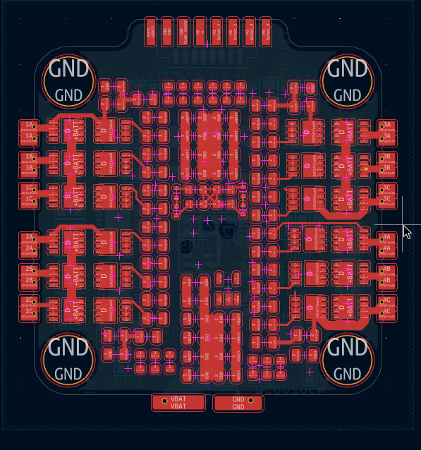
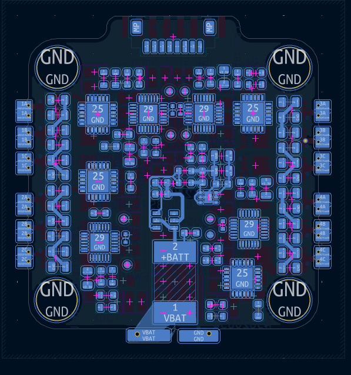

# Drone Journal 6 - 31/03/2026 <-> 02/04/2026

Welp, I haven't given an update in a couple days, mainly because I started my second project on the 31st, but also because my laptop charger finally gave out so I was unable to do any work yesterday. Fortunately, I did end up fixing it but I had to wait until I could go and get some bigger heatshrink, which took a minute.

Anyways, I'm back now and ready to rock! Last day of school for the term for me as well, which is nice; Next few weeks should see massive progress.

## Onto it!

My first order of business today was finishing off the layout of the pcb for the ESCs. I was extremely worried about everything fitting, but after shuffling some things around, I've squeezed it all in \:)

It might be quite a pain to route though, but given I've got 4 layers to work with, I'm sure I can make it happen.

I'm considering getting two side pcba, because it all looks like hell to solder. If its too expensive, I can probably solder up on side, but I'm not sure if I'd do the top or bottom.

However, those problems are for future me, for now: Routing!

---

Hmmm, I have bad news...
This layout is not really gonna work \:(
In short, not only is everything really tightly jammed, but I've not really considered a lot of the routing of high power stuff, and I'm not very confident that things wouldn't just go up in a pile of smoke. I think I'm going to make a few changes and see about doing a slightly better design.

My first thing will probably be to just increase the size of the board a little. Instead of 30.5x30.5, I'll go to a 40x40/Φ3mm design. Which should give me a lot more flexibility in layout and routing. I'll also probably try to get some smaller components, and finally I'm also going to use a 6 layer pcb, which will absolutely help with power handling.

It could also be an option to go with 4 seperate ESC's instead of one main board, but this imposes additional challenges with power distribution, albeit different ones.

