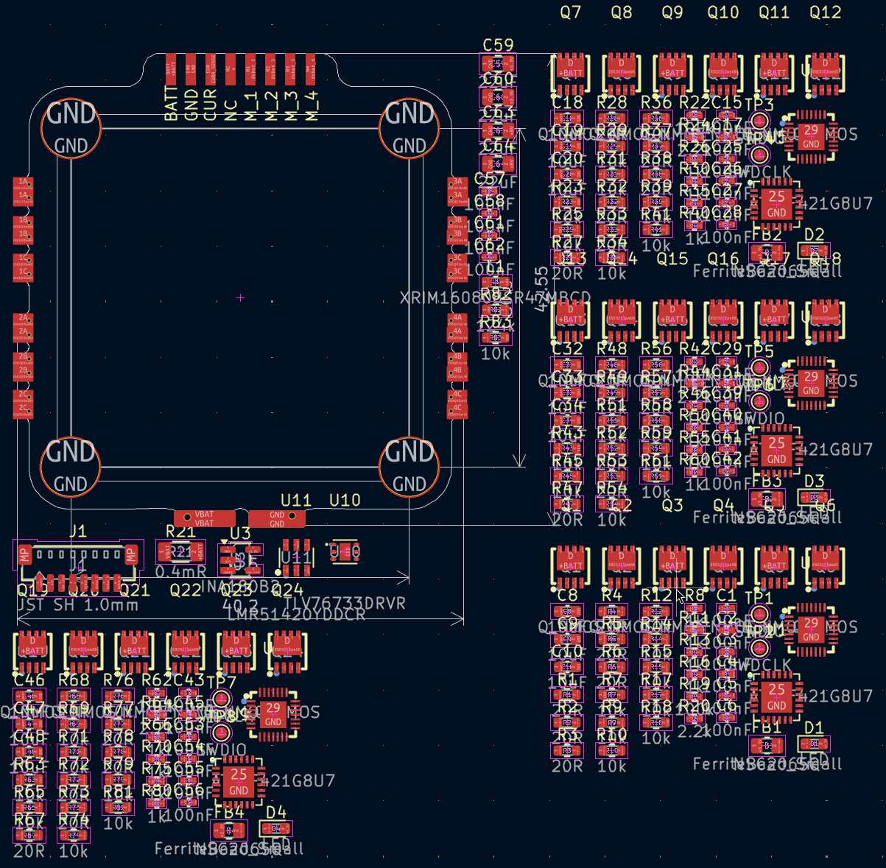
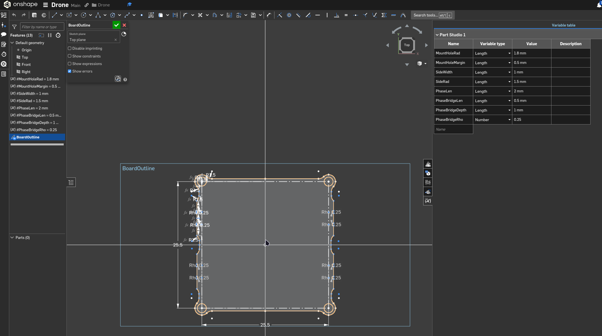

# Drone Journal 8 - 03/04/2026

Today I'm going to spec some components (again), relayout the board for the new format, and then if I have time, layout the components and maybe even route the board!

While I'm going through, I'm going to note a couple tradeoffs and decisions I've made, so if something breaks, I know whats likely to blame:

---

- Bemf Resistors - Gone with 100mW, should be fine but I haven't done the maths. Just from looking at it I'd say theres little to no current flowing.
- Bootstrap Caps - 0402 might be too small, but everything else is fine.
- VDD Bypass caps - I changed from 4x22uF to 3x10uF, which is still well above the 1uF needed for the bootstrap caps. 25V should be good because battery is max ~8v.
- 10k volt sense div resistor - Could have done 0402, but jlc parts required a min order of 9000, just went to 0603.
- Need to redo maths of shunt resistor for new target current.

---

Side project, redoing shunt resistor maths!

did it and `0.5mR` shunt resistor seems good, gives 132A max current which is reasonable, and power heat is manageable (~1.5W).

---

Alrighty, the bom is redone!
|Basic?|Desc                                                 |Value      |Part Details                                                                                                                                                                                                              |Package                            |JLCPCB                                                                |Num|Unit Price|Net Price|Running Total|
|------|-----------------------------------------------------|-----------|--------------------------------------------------------------------------------------------------------------------------------------------------------------------------------------------------------------------------|-----------------------------------|----------------------------------------------------------------------|---|----------|---------|-------------|
|TRUE  |Mosfet Gate Resistors (R1-R6, ...)                   |20r        |-55℃~+155℃ 100mW 20Ω 75V Thick Film Resistor ±1% ±100ppm/℃ 0603 Chip Resistor - Surface Mount ROHS                                                                                                                        |0603                               |https://jlcpcb.com/partdetail/23677-0603WAF200JT5E/C22950             |24 |$0.0016   |$0.04    |$0.04        |
|TRUE  |BEMF Div Resistor (R9, R12, R15, ...)                |10k        |-55℃~+155℃ 100mW 10kΩ 75V Thick Film Resistor ±1% ±100ppm/℃ 0603 Chip Resistor - Surface Mount ROHS                                                                                                                       |0603                               |https://jlcpcb.com/partdetail/26547-0603WAF1002T5E/C25804             |12 |$0.0013   |$0.02    |$0.05        |
|TRUE  |BEMF Div Resistor (R11, R13, R16, ...)               |1k         |-55℃~+155℃ 1kΩ 50V 62.5mW Thick Film Resistor ±1% ±100ppm/℃ 0402 Chip Resistor - Surface Mount ROHS                                                                                                                       |0402                               |https://jlcpcb.com/partdetail/12256-0402WGF1001TCE/C11702             |12 |$0.0007   |$0.01    |$0.06        |
|TRUE  |BEMF Div Resistor (R10, R14, R17, ...)               |10k        |-55℃~+155℃ 100mW 10kΩ 75V Thick Film Resistor ±1% ±100ppm/℃ 0603 Chip Resistor - Surface Mount ROHS                                                                                                                       |0603                               |https://jlcpcb.com/partdetail/26547-0603WAF1002T5E/C25804             |12 |$0.0013   |$0.02    |$0.08        |
|TRUE  |Bootstrap Cap (C1-C3, ...)                           |100nF      |100nF 50V X7R ±10% 0402 Multilayer Ceramic Capacitors MLCC - SMD/SMT ROHS                                                                                                                                                 |0402                               |https://jlcpcb.com/partdetail/291005-CL05B104KB54PNC/C307331          |12 |$0.0043   |$0.05    |$0.13        |
|TRUE  |VDD Bypass Caps (C8-C10, ...)                        |10uF       |10uF 25V X5R ±20% 0603 Multilayer Ceramic Capacitors MLCC - SMD/SMT ROHS                                                                                                                                                  |0603                               |https://jlcpcb.com/partdetail/97651-CL10A106MA8NRNC/C96446            |12 |$0.0180   |$0.22    |$0.35        |
|TRUE  |Volt Sense Div Resistor (R18, ...)                   |10k        |-55℃~+155℃ 100mW 10kΩ 75V Thick Film Resistor ±1% ±100ppm/℃ 0603 Chip Resistor - Surface Mount ROHS                                                                                                                       |0603                               |https://jlcpcb.com/partdetail/26547-0603WAF1002T5E/C25804             |4  |$0.0013   |$0.01    |$0.35        |
|TRUE  |Volt Sense Div Resistor (R19, ...)                   |100k       |-55℃~+155℃ 100kΩ 50V 62.5mW Thick Film Resistor ±1% ±100ppm/℃ 0402 Chip Resistor - Surface Mount ROHS                                                                                                                     |0402                               |https://jlcpcb.com/partdetail/26484-0402WGF1003TCE/C25741             |4  |$0.0008   |$0.00    |$0.35        |
|TRUE  |ESC Indicator LED (D1, ...)                          |NA         |-40℃~+85℃ 1.8V~2.4V 120° 20mA 300mcd 40mW 615nm~630nm 645nm Discrete Diode Red Water Clear 0603 LED Indication - Discrete ROHS                                                                                            |0603                               |https://jlcpcb.com/partdetail/Hubei_KENTOElec-KT0603R/C2286           |4  |$0.0065   |$0.03    |$0.38        |
|TRUE  |ESC Indicator LED Resistor (R20, ...)                |2.2k       |-55℃~+155℃ 2.2kΩ 50V 62.5mW Thick Film Resistor ±1% ±100ppm/℃ 0402 Chip Resistor - Surface Mount ROHS                                                                                                                     |0402                               |https://jlcpcb.com/partdetail/26622-0402WGF2201TCE/C25879             |4  |$0.0008   |$0.00    |$0.38        |
|TRUE  |ESC Decoupling Capacitors (C4, C6, ...)              |100nF      |100nF 50V X7R ±10% 0402 Multilayer Ceramic Capacitors MLCC - SMD/SMT ROHS                                                                                                                                                 |0402                               |https://jlcpcb.com/partdetail/291005-CL05B104KB54PNC/C307331          |8  |$0.0043   |$0.03    |$0.42        |
|FALSE |Mosfets (Q1-Q6, ...)                                 |NA         |-55℃~+150℃ 1 N-channel 1.5V 1.675nF 2.9mΩ@10V、4.2mΩ@4.5V 26nC@20V 31pF 395pF 40V 55W 75A N-Channel PDFN-8L(3x3) MOSFETs ROHS                                                                                              |PDFN-8L(3x3)                       |https://jlcpcb.com/partdetail/Siliup-SP40N03GNJ/C22466709             |24 |$0.2194   |$5.27    |$5.68        |
|TRUE  |Dshot Resistor (R8, ...)                             |1k         |-55℃~+155℃ 1kΩ 50V 62.5mW Thick Film Resistor ±1% ±100ppm/℃ 0402 Chip Resistor - Surface Mount ROHS                                                                                                                       |0402                               |https://jlcpcb.com/partdetail/12256-0402WGF1001TCE/C11702             |4  |$0.0007   |$0.00    |$5.69        |
|TRUE  |Boot0 Resistor (R7, ...)                             |10k        |-55℃~+155℃ 100mW 10kΩ 75V Thick Film Resistor ±1% ±100ppm/℃ 0603 Chip Resistor - Surface Mount ROHS                                                                                                                       |0603                               |https://jlcpcb.com/partdetail/26547-0603WAF1002T5E/C25804             |4  |$0.0013   |$0.01    |$5.69        |
|TRUE  |NRST Capacitor (C5, ...)                             |100nF      |100nF 16V X7R ±10% 0402 Multilayer Ceramic Capacitors MLCC - SMD/SMT ROHS                                                                                                                                                 |0402                               |https://jlcpcb.com/partdetail/1877-CL05B104KO5NNNC/C1525              |4  |$0.0013   |$0.01    |$5.70        |
|TRUE  |Ferrite Bead (FB1, ...)                              |100R-100MHz|1 100Ω@100MHz 150mΩ 800mA ±25% 0805 Ferrite Beads ROHS                                                                                                                                                                    |0805                               |https://jlcpcb.com/partdetail/Sunlord-GZ2012D101TF/C1015              |4  |$0.0149   |$0.06    |$5.76        |
|FALSE |ESC MCU (U2, ...)                                    |NA         |-40℃~+105℃ 120MHz 16KB 2.4V~3.6V 23 32 Bit 64KB ARM Cortex-M4 Built-in+External FLASH QFN-28-EP(4x4) Microcontrollers (MCU/MPU/SOC) ROHS                                                                                  |QFN-28-EP(4x4)                     |https://jlcpcb.com/partdetail/ARTERY-AT32F421G8U7/C2765098            |4  |$0.8444   |$3.38    |$9.13        |
|FALSE |ESC Mosfet Gate Driver (U1, ...)                     |NA         |-40℃~+125℃ 1.2A 1.5A 15ns 40ns 5V~20V 700uA IGBT、MOSFET Three Phase Under Voltage Protection QFN-24-EP(4x4) Gate Drivers ROHS                                                                                             |QFN-24-EP(4x4)                     |https://jlcpcb.com/partdetail/WXNSIC-NSG2065Q/C41414478               |4  |$0.4667   |$1.87    |$11.00       |
|      |MAIN BOARD COMPONENTS NOW                            |           |                                                                                                                                                                                                                          |                                   |                                                                      |   |          |$0.00    |$11.00       |
|      |Current Sense Amplifier (U3)                         |NA         |-26V~+26V -40℃~+125℃ 0.05uA 1 100dB 100nA 197uA 1uV/℃ 2.7V~5.5V 200mV~26V 210kHz 25uV 2V/us 40nV/√Hz@1kHz 5.5V 50V/V 8mA SOT-23-5 Current Sense Amplifiers ROHS                                                           |SOT-23-5                           |https://jlcpcb.com/partdetail/TexasInstruments-INA180B2IDBVR/C2861539 |1  |$0.4206   |$0.42    |$11.42       |
|FALSE |8V Regulator (U11)                                   |NA         |-40℃~+150℃@(TJ) 1 1.1MHz 2A 4.5V~36V 40uA 600mV~34.2V Adjustable Buck Buck Built-in Yes SOT-23-6 DC-DC Converters ROHS                                                                                                    |SOT-23-6                           |https://jlcpcb.com/partdetail/TexasInstruments-LMR51420YFDDCR/C7296200|1  |$1.1808   |$1.18    |$12.60       |
|FALSE |3.3V Regulator (U10)                                 |NA         |-40℃~+125℃@(Tj) 1 1.4V@(1A) 16V 1A 3.3V 46dB@(1MHz) 50uA 60uVrms Fixed Over Current Protection、Over Temperature Protection、Soft Start Positive WSON-6(2x2) Voltage Regulators - Linear, Low Drop Out (LDO) Regulators ROHS|WSON-6(2x2)                        |https://jlcpcb.com/partdetail/TexasInstruments-TLV76733DRVR/C2848334  |1  |$0.2151   |$0.22    |$12.82       |
|FALSE |Shunt Resistor (R21)                                 |0.5mr      |0.5mΩ 3W Current Sense Resistor SMD ±1% ±50ppm/℃ 1206 Current Sense Resistors / Shunt Resistors ROHS                                                                                                                      |1206                               |https://jlcpcb.com/partdetail/Milliohm-HoSRX1206_3W_0_5mR_1/C18724161 |1  |$0.3060   |$0.31    |$13.12       |
|FALSE |Inductor (L1)                                        |470nH      |3.8A 38mΩ 470nH 4A ±20% 0603 Power Inductors ROHS                                                                                                                                                                         |0603                               |https://jlcpcb.com/partdetail/XR-XRIM160808SR47MBCD/C48391583         |1  |$0.1348   |$0.13    |$13.26       |
|TRUE  |Main Board Decoupling Capacitors (C57, C58, C61, C62)|100nF      |100nF 50V X7R ±10% 0402 Multilayer Ceramic Capacitors MLCC - SMD/SMT ROHS                                                                                                                                                 |0402                               |https://jlcpcb.com/partdetail/291005-CL05B104KB54PNC/C307331          |4  |$0.0043   |$0.02    |$13.27       |
|TRUE  |Main Board Filtering Capacitors (C59, C60, C63, C64) |22uF       |22uF 25V X5R ±20% 0805 Multilayer Ceramic Capacitors MLCC - SMD/SMT ROHS                                                                                                                                                  |0805                               |https://jlcpcb.com/partdetail/46786-CL21A226MAQNNNE/C45783            |4  |$0.0316   |$0.13    |$13.40       |
|TRUE  |Main Board Voltage Div Resistor (R83)                |10k        |-55℃~+155℃ 100mW 10kΩ 75V Thick Film Resistor ±1% ±100ppm/℃ 0603 Chip Resistor - Surface Mount ROHS                                                                                                                       |0603                               |https://jlcpcb.com/partdetail/26547-0603WAF1002T5E/C25804             |1  |$0.0013   |$0.00    |$13.40       |
|FALSE |Main Board Voltage Div Resistor (R82)                |124k       |-55℃~+155℃ 100mW 124kΩ 75V Thick Film Resistor ±1% ±100ppm/℃ 0603 Chip Resistor - Surface Mount ROHS                                                                                                                      |0603                               |https://jlcpcb.com/partdetail/23515-0603WAF1243T5E/C22788             |1  |$0.0014   |$0.00    |$13.40       |
|FALSE |JST Connector (J1)                                   |NA         |-25℃~+85℃ 1 10mm 1A 1mm 1x8P 2.9mm 4.32mm 50V 8 8P Auxiliary Solder Pin Copper alloy PA SH Surface Mount, Right Angle Tin UL94V-0 White SMD,P=1mm,卧贴 Wire To Board Connector ROHS                                         |SMD,P=1mm,Surface Mount，Right Angle|https://jlcpcb.com/partdetail/JST-SM08B_SRSS_TB_LF_SN/C160407         |1  |$0.3062   |$0.31    |$13.71       |

Looks simply splendid!

Now it's time to reassign all my footprints \:)
...
Done! Board now looks like this, much more manageable I reckon.

### Board Design

Next I'm going to actually design the ESC board outline around where it needs to go / the frame. This does mean I need to have a look at some frames, and decide which style I'm going with.

After some research, the [BetaFPV Air 65](https://www.aliexpress.com/item/1005009415953442.html) is looking promising. It's cheap, commonly used and even has technical drawings!

This frame uses a 25.5x25.5mm FC mounting design, with M1.4 screws.
This is slightly smaller than my current design (30.5x30.5mm), but the smaller screws will absolutely help (current ones are M3).

---

I've whipped up a quick design for the board outline in onshape, first time using it and its much better than fusion lol. Also my first time doing proper parameterized stuff, and thats quite fun as well. 

Importing it into KiCad, and it is a wee bit smaller than the orignal size, but I'm sure it'll work (i'm not but yknow).

### Layout time

I have made a breakthrough on the layout. Before I was having all the mosfets on the same side of the board, but I can actually have each half of the half bridge on opposite sides of the board, as they both connect via the pads on the edge, which are connected through the board.

I'll pick this up tomorrow and hopefully finish off the layout \:)
G'night!