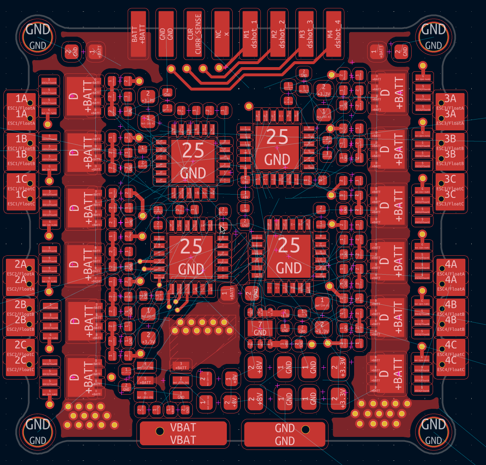
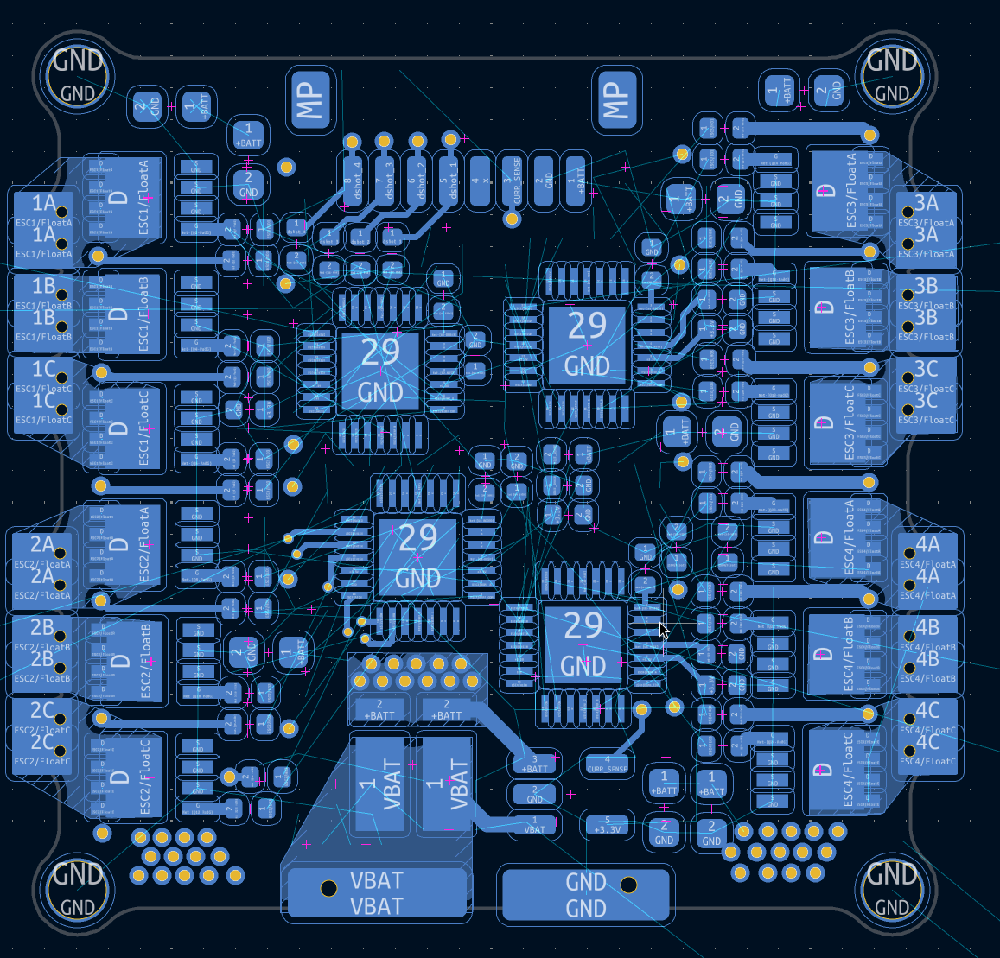

# Drone Journal 9 - 04/04/2026

Welcome back folks! Today is layout time \:O
I'll just get straight into it and report back occasionally through the process!

---
First report!
I'm going to quickly redo the maths on this shunt resistor, it looks really small and I'm not sure if 3w is enough lol.

> P = I2 x R
> P = 602 x 0.5*10-3
> P = 1.8 W

I'd like to give a bit more headroom than `3W` I think, so I might look at getting a `5W` one.

Alright I found one pretty easily, and its only very slightly bigger than my current one and has a `5W` rating \:)

---

Second report!

I've layed out most of the stuff but yet again I'm not going to have enough space. I think if I can swap the 0603 10k resistors with an 0402 version it will greatly help. The only reason they're 0603 in the first place is because the only option for the part on jlcpcb requires a min order of 9000 parts. What I might do is bite the bullet and use non basic parts for those resistors, which will just mean an extra 2 dollars.

---

Third report!
I've also decided to shrink the gate resistors slightly, down from 0603 to 0402 (100mW to 62.5mW). This should be fine as they don't see a lot of continuous current (only high current pulses to charge the mosfet when switching). This should be something to consider when stuff does break though, as it's not quite as good as 100mW resistors.

---

BREAK TIME i have a band practice!

---

Break done back to work!

---

Fourth report!

Ferrite beads are going! They're big and probably unnecessary.

---

Fifth report!
Just realised my voltage sensing is copied across all 4 MCU's, only need one so I'll just chuck it on the bit with the most space, which looks to be ESC 3.

---

Layout is done!
I'm not sure if its physically possible to route this, but I'll just adjust the layout as I go as necessary. Hopefully its relatively painless lol.

I'm going to once again split the journal here, I might do a bit more work but I want to play satisfactory before my crunch day tomorrow where I'll do a bunch of work.

Thats all for tonight! Much love :3