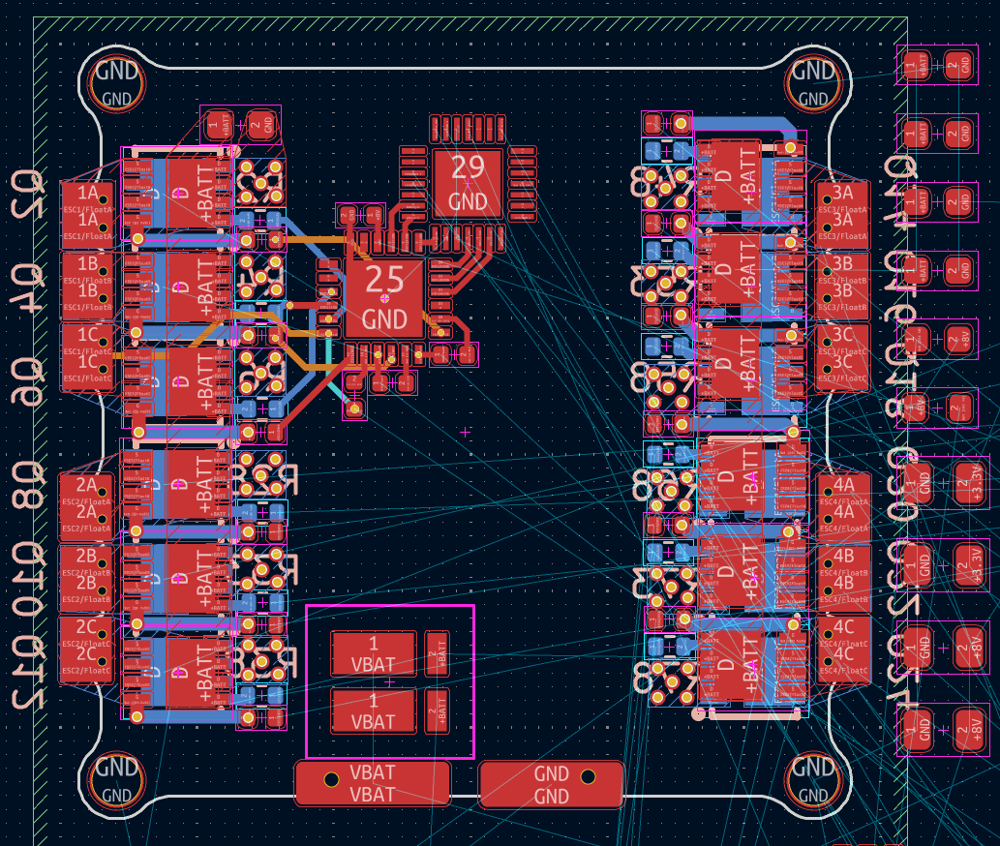

# Drone Journal 11 - 05/04/2026

Welp I have received clarification from Tirthak that it is ok (ty tirthak :))
I'll layout and route with this and hopefully it all goes well.

---

I have decided I'll go back to single mosfets, the smaller size makes layout a lot easier even if there are more of them.

---

A wee bit through the layout now; Things are going well! I've just decided to have only one LED, instead of four. They were all just from the same power source anyway so not much point in having multiple, as it gives no additional information.

