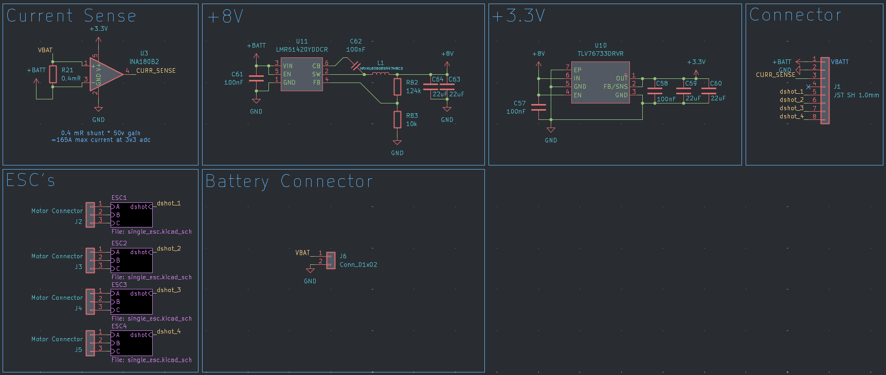
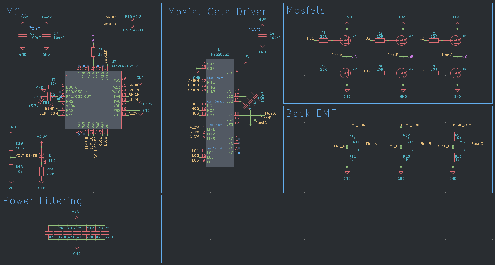
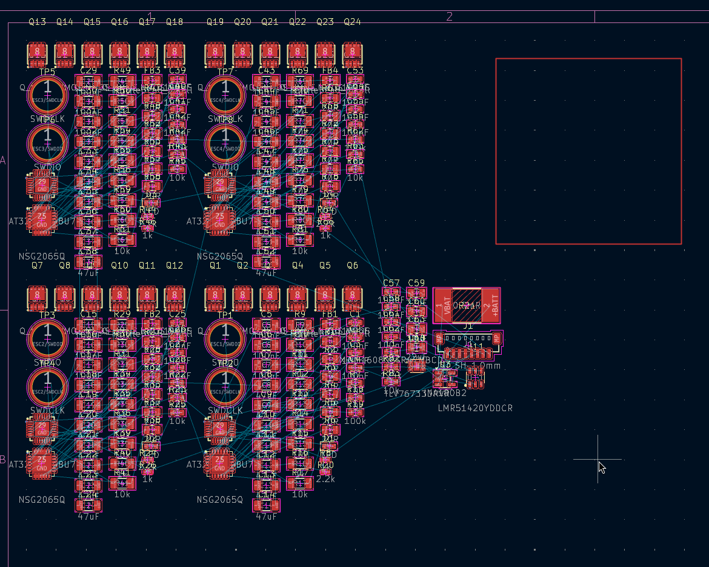

# Drone Journal 4 - 29/03/2026

It's still esc time busters!
Getting straight back into schematic work, just need to finish wiring up the MCU and then sort out other stuff.

Ok some notes for future me again!
Current sensing is done by a current sense amplifier, wherein you add a very small shunt resistor, which induces a voltage drop, and then multiply the voltage drop by the amplifier gain, and then measure that voltage via an adc on a mcu to get the current.

I'm using a 50v/v gain amplifier, and we need to keep the voltage on the adc <= 3.3v
```
V=IR * GAIN
```
So given a constant V (3.3), we can choose a desired max current and then solve for the resistor size.
```
R= V / (I*GAIN)
```

For a max current of let's say, 100 amps, we would need a 0.66mΩ resistor.
Looking at the jlcpcb basic parts, the smallest resistor is 100mΩ, which would give us... 0.66A of max current \:(

<s>Oh welp, extended parts it is.</s> So it turns out jlcpcb doesn't stock any small enough resistors, so I'll just need to buy my own.

I'm going to go with a 0.3mΩ resistor, which will give a max current of 220A, and need a power dissipation of ~10W.

Alrighty, now thats all wired up, it's time to move onto getting the voltages we need, which are 3.3v and 8v. Fortunately, I can steal a bit of circuitry from the reference, but I'll need to get the 8v regulation myself.

I've opted for the LMR51420 chip, which is designed for taking in battery power pretty much. It does have a range of 4.5v - 36v however, which means that 1s batteries are off the table. I was always planning to use 2-4s batteries, so there shouldn't be any problems. 

Ok, I've tidied up the schematic a bit and it's looking pretty good! Theres some drc errors but I'm pretty sure they're all ok, just crappy symbols from the lcsc tool.
Anyways, heres the schematic as of now \:)




Now it's time to sort out my bom and get footprints done \:)

---

Ok, I've hit my first hurdle when specing components. For basic parts, the highest voltage 47uF caps JLCPCB offers are 10V, which would limit me to a 2s battery. I think I'll go with this for now, but I might change it in the future.

---

Welp that took longer than I thought it would, but I've finished it now. I don't need to spec a few of the components because they'll just be solderable pads on the board (specifically the motor outputs and battery connector). This is looking to be a wee bit expensive though \:( 
Oh well, what can ya do.

Now that's done, I can get cracking on assigning all my footprints in KiCad, but after that, I reckon I'll head to bed, getting a bit late and I'm kinda tired lol.

---

Done! Well, the pcb's looking kinda scary to lay out lol:

Not a job for today though! Goodnight peoples \:)