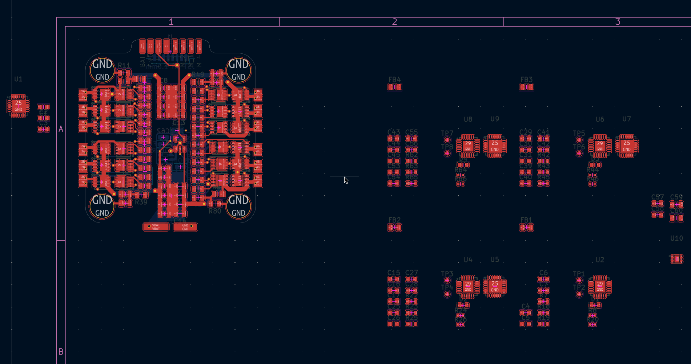
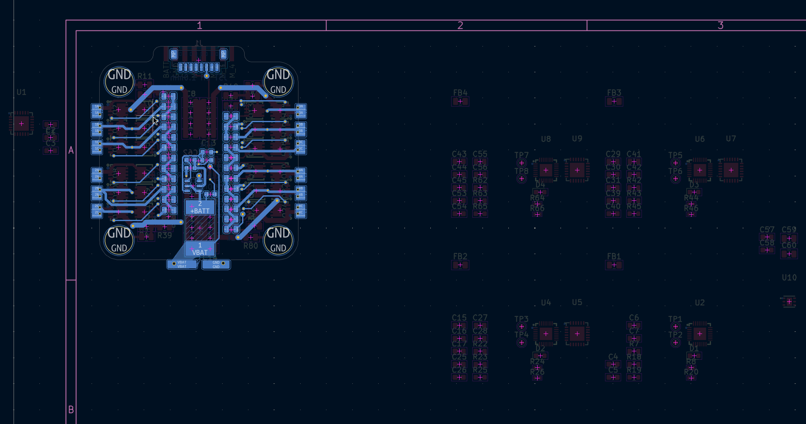

# Drone Journal 5 - 29/03/2026

Welcome back to drone day 5! 

Today was a pretty chill day, I made the choice to swap a bunch of components to lower power rated versions, just to decrease the size a little bit. I think that most of the time, currents will low enough that it shouldn't matter, and high currents *should* only be momentary. Hopefully its fine, only time will tell. Other than that, I started work on the layout and routing. I sorted out the main footprint for the board, and have layed out and routed a bunch of stuff, but in all honesty I'm doubting it will fit. I'm going to go through and see where I can shrink / cut components, or maybe do better layout. If all else fails, I can increase the size of the esc, but this would be a bit unfortunate, as they are made to a roughly standard size and I would love to stick with that for compatibilities sake. Potentially I'll spec down the esc to a lower max rating, which could help the size a lot.

Bis morgen!